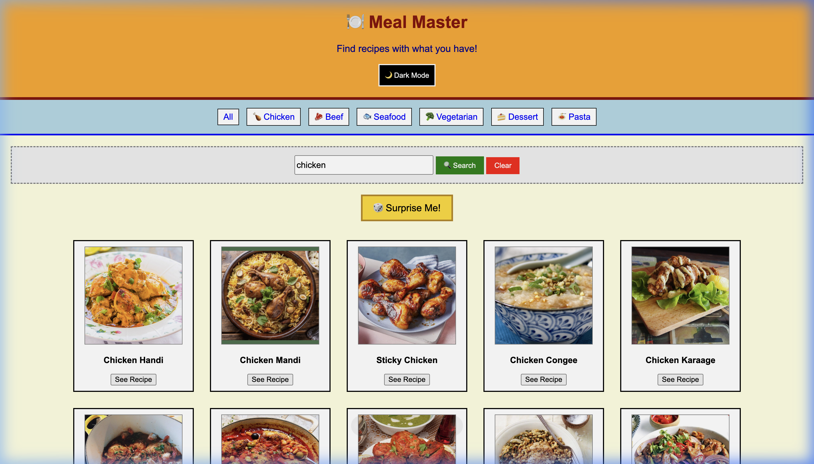
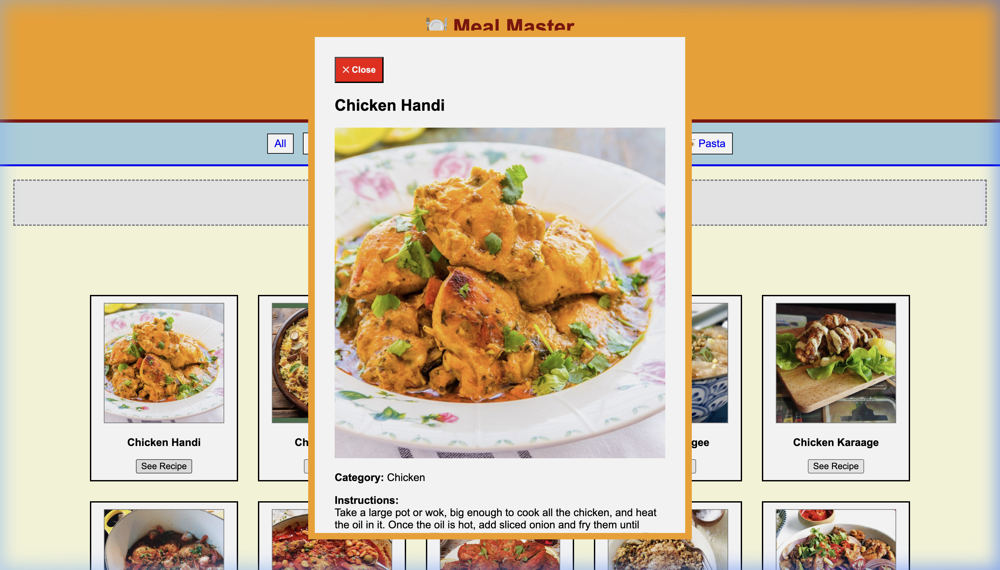

# 🍽 Meal Master – Recipe Finder

## 📌 Overview

Meal Master is a web application that helps users find recipes based on ingredients they already have. It simplifies cooking decisions by suggesting meals instantly. 

This version was specifically built with:
- **Beginner-friendly** clean, readable code structure
- **Array Higher-Order Functions** for all data operations (filter, map, find, sort, forEach)
- **Simple, old-school 90s aesthetic** that is easy to understand

## 📸 Screenshots

### Search Results


### Recipe Detail Popup


## 🚀 Features

* Search recipes by ingredient or meal name
* Filter meals by category (Chicken, Beef, Seafood, etc.)
* "Surprise Me!" button to get a random meal instantly
* View detailed cooking instructions and ingredients in a popup modal
* Alphabetical sorting (A-Z and Z-A)
* Interactive Like buttons to mark favorite meals
* Dark Mode toggle for comfortable viewing
* **Fully responsive** and accessible design

## 🎯 Code Quality Standards

### ✅ Array Higher-Order Functions (No Traditional Loops)
- **`.filter()`** - Search and filter meals by category or name
- **`.map()`** - Convert meal data into HTML cards
- **`.find()`** - Locate specific meals efficiently
- **`.sort()`** - Sort meals alphabetically
- **`.forEach()`** - Iterate over category buttons

### ✅ Best Practices Implemented
- **Clean Code** - Readable variable names, proper indentation
- **Modular Functions** - Separated concerns (API logic, UI, filtering)
- **DRY Principle** - No code repetition (reusable helper functions)
- **Error Handling** - Graceful API error handling with `.catch()`
- **Meaningful Comments** - Clear documentation for learners
- **Responsive Design** - Works on all screen sizes

## 🔗 API Used

The project uses TheMealDB API to fetch recipe data:
https://www.themealdb.com/api.php

## 🛠 Tech Stack

* HTML5
* Vanilla CSS
* Vanilla JavaScript (ES6+ features)

## ⚙️ Setup Instructions

1. Clone the repository:

```bash
git clone https://github.com/ManojAhire/Meal-Master-Smart-Recipe-Finder.git
```

2. Navigate to the project folder:

```bash
cd Meal-Master-Smart-Recipe-Finder
```

3. Open `index.html` in any web browser! No `npm install` or build steps required.

## 📝 Code Structure

```
index.html          - HTML markup (clean structure)
style.css           - Styling (no changes to visual design)
script.js           - JavaScript (refactored for readability)
├── DOM Elements    - Element references at the top
├── Event Listeners - All click handlers
├── Dark Mode       - Theme toggle functionality
├── Search & Filter - Array Higher-Order Functions
├── API Fetching    - Error-handled API calls
├── Display Logic   - Rendering functions
└── Initialization  - App startup
```

## 🎯 Future Improvements

* Add shopping list feature
* Save favorite recipes (add back LocalStorage)
* Add nutrition information
* Add recipe ratings system

## 👨‍💻 Author

Manoj Ahire
